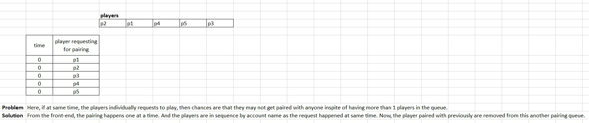

# GPK.Battles Game on WAX Blockchain

## Workflow
This workflow is as per the Game App.

### Old
1. players transfer cards (with combo: 2a1b/1a2b) to escrow contract - `gpkbatescrow`
1. pair2players
1. players transfer 5 WAX each
1. players select cards manually/automatically based on time_limit of 30 sec
1. play
1. Now, Result:
	- Case-1: if draw, then players get 1 more chance. If 2 times draw successively for 1 game_id, then the round is dumped. And the card is available for selection in the cardwallet
	- Case-2: if nodraw, then winner receives 4 cards with 1 as winning reward, whereas the loser receives 2 cards with 1 losing card (any by shuffle)

### New
1. player deposit game fee 
1. player transfers 3 cards (with combo: `2a1b`/`1a2b`) from `simpleassets` contract to `gpkbatescrow` contract.
1. player selects the cards & the respective cards' status is set as __"selected"__ & gets added into the players queue for pairing
1. then presses <kbd>Pair</kbd> button to get paired with someone, 
	- in the front-end, the player is in pairing queue to get paired. If paired with someone, then the player is removed from this queue in Front-end.

  

	- where in the front-end the player gets to see the player's display pic (dp), but not eosio-accnt name, cards.
1. then the game_id is sent to the player & then the player1 presses <kbd>Play</kbd> button [OPTIONAL] with the game_if
	- Here, the player2 is just notified about the pairing & game status. But, not allowed to press any play button once paired with a player. Otherwise, the 2 players will be  pressing play button at same/different time. Although, nothing will happend but this is not recommended.
1. Now, Result:
	- Case-1: if draw, then players get 1 more chance. If 2 times draw successively for 1 game_id, then the round is dumped. And the card is available for selection in the cardwallet
	- Case-2: if nodraw, then winner receives 4 cards with 1 as winning reward, whereas the loser receives 2 cards with 1 losing card (any by shuffle)

## References
* simpleassets - https://wax.bloks.io/account/simpleassets?loadContract=true&tab=Tables&table=sassets&account=simpleassets&scope=simpleassets&limit=100
* [How to Create a Random Number Generator in C++](https://www.bitdegree.org/learn/random-number-generator-cpp)