## Testnet
### 1. Transfer cards from simpleassets to gpkbatescrow contract (if not available in cardwallet table)
* player transfers the cards from simpleassets to gpkbatescrow (here, 1a2b is chosen)
```console
$ cleosw push action simpleassets transfer '{"from": "gbuser111111", "to": "gpkbatescrow", "assetids": ["100000000007690", "100000000007691", "100000000007692"], "memo": "transfer cards for gpk.battles playing"}' -p gbuser111111@active
executed transaction: 9f191ede4ea8780052be2506174c36a914ffc553c58637a1b2487457856e97ec  216 bytes  678 us
#  simpleassets <= simpleassets::transfer       {"from":"gbuser111111","to":"gpkbatescrow","assetids":["100000000007690","100000000007691","10000000...
#  gbuser111111 <= simpleassets::transfer       {"from":"gbuser111111","to":"gpkbatescrow","assetids":["100000000007690","100000000007691","10000000...
#  gpkbatescrow <= simpleassets::transfer       {"from":"gbuser111111","to":"gpkbatescrow","assetids":["100000000007690","100000000007691","10000000...
warning: transaction executed locally, but may not be confirmed by the network yet         ]
```
	- view the cardwallet table & get the cards transferred here.

	- view the sassets table & find no cards as transferred to escrow contract (gpkbatescrow)
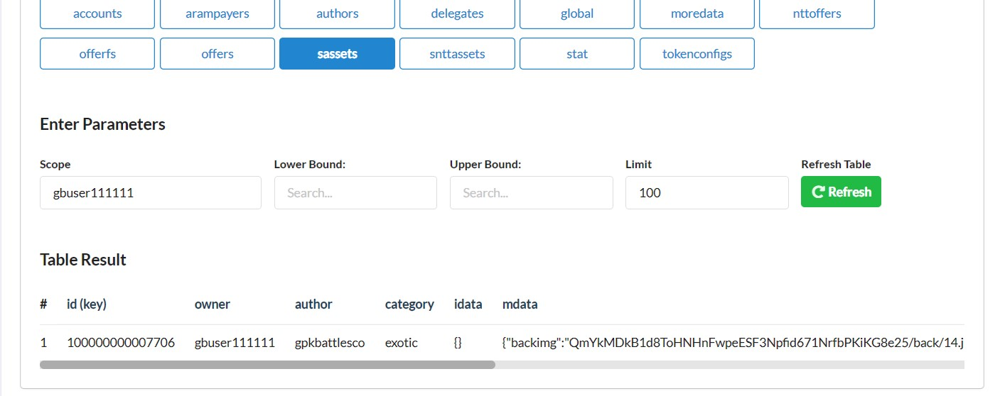

* player transfers the cards from simpleassets to gpkbatescrow (here, 2a1b is chosen)
```console
$ cleosw push action simpleassets transfer '{"from": "gbuser111112", "to": "gpkbatescrow", "assetids": ["100000000007716", "100000000007695", "100000000007714"], "memo": "transfer cards for gpk.battles playing"}' -p gbuser111112@active
executed transaction: d28b9d23d546c433e5a3ed5a3f9a0f7f28dff94b529fdd428fafe484af67c0fe  216 bytes  719 us
#  simpleassets <= simpleassets::transfer       {"from":"gbuser111112","to":"gpkbatescrow","assetids":["100000000007716","100000000007695","10000000...
#  gbuser111112 <= simpleassets::transfer       {"from":"gbuser111112","to":"gpkbatescrow","assetids":["100000000007716","100000000007695","10000000...
#  gpkbatescrow <= simpleassets::transfer       {"from":"gbuser111112","to":"gpkbatescrow","assetids":["100000000007716","100000000007695","10000000...
warning: transaction executed locally, but may not be confirmed by the network yet         ]
```
	- view the cardwallet table & get the cards transferred here.
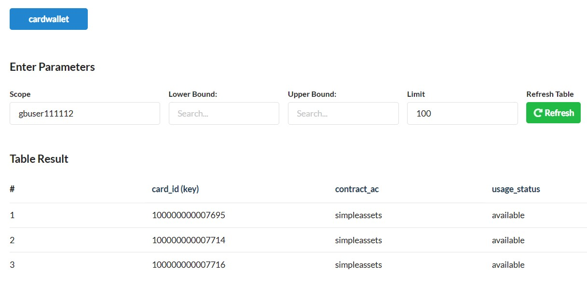
	- view the sassets table & find no cards as transferred to escrow contract (gpkbatescrow)
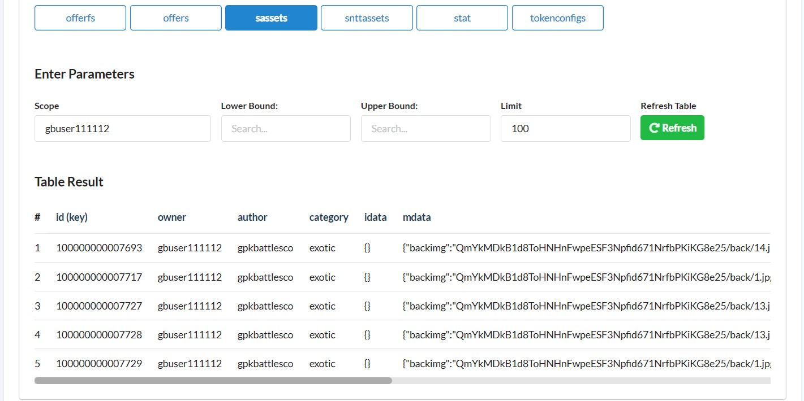

* player transfers the cards from simpleassets to gpkbatescrow (here, 2a1b is chosen)
```console
$ cleosw push action simpleassets transfer '{"from": "gbuser111113", "to": "gpkbatescrow", "assetids": ["100000000007710", "100000000007721", "100000000007725"], "memo": "transfer cards for gpk.battles playing"}' -p gbuser111113@active
executed transaction: d28b9d23d546c433e5a3ed5a3f9a0f7f28dff94b529fdd428fafe484af67c0fe  216 bytes  719 us
#  simpleassets <= simpleassets::transfer       {"from":"gbuser111112","to":"gpkbatescrow","assetids":["100000000007716","100000000007695","10000000...
#  gbuser111112 <= simpleassets::transfer       {"from":"gbuser111112","to":"gpkbatescrow","assetids":["100000000007716","100000000007695","10000000...
#  gpkbatescrow <= simpleassets::transfer       {"from":"gbuser111112","to":"gpkbatescrow","assetids":["100000000007716","100000000007695","10000000...
warning: transaction executed locally, but may not be confirmed by the network yet         ]
```
	- view the cardwallet table & get the cards transferred here.
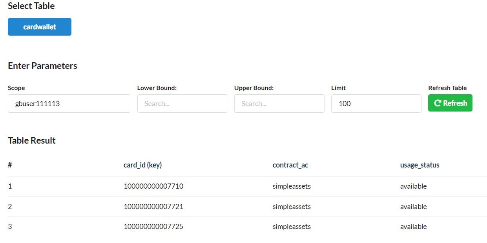
	- view the sassets table & find no cards as transferred to escrow contract (gpkbatescrow)
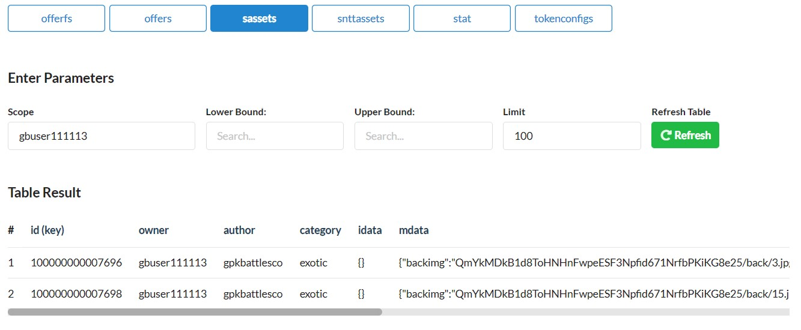

### 2. player transfers game fee (no transfer, if balance is maintained)
### 3. player selects 3 cards from escrow contract i.e. cardwallet table
* player select cards
```console
$ cleosw push action gpkbattlesc1 sel3card '["gbuser111111", "simpleassets", "100000000007690", "100000000007691", "100000000007692"]' -p gbuser111111@active
executed transaction: ff2c366a98d250670ecc39a7aa19437182c0e85ef38259c445264b13a5250ac3  136 bytes  412 us
#  gpkbattlesc1 <= gpkbattlesc1::sel3card       {"player":"gbuser111111","asset_contract_ac":"simpleassets","card1_id":"100000000007690","card2_id":...
#  gpkbatescrow <= gpkbatescrow::setcstatus     {"player":"gbuser111111","card_id":"100000000007690","status":"selected"}
#  gpkbatescrow <= gpkbatescrow::setcstatus     {"player":"gbuser111111","card_id":"100000000007691","status":"selected"}
#  gpkbatescrow <= gpkbatescrow::setcstatus     {"player":"gbuser111111","card_id":"100000000007692","status":"selected"}
#  gpkbattlesc1 <= gpkbattlesc1::empifyplayer   {"asset_contract_ac":"simpleassets","player":"gbuser111111"}
warning: transaction executed locally, but may not be confirmed by the network yet         ]
```
	- view the cardwallet table & view the cards are selected
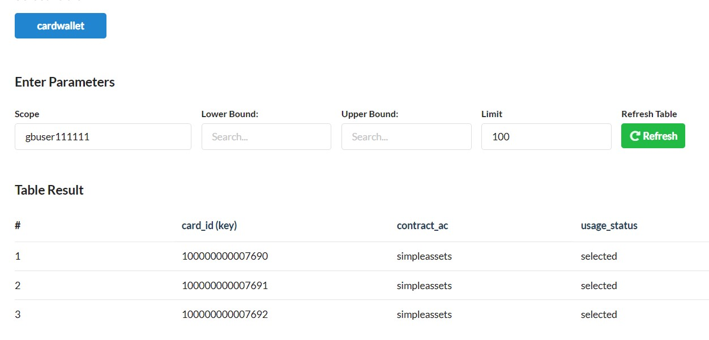
	- view the players table & confirm that the player is added for pairing
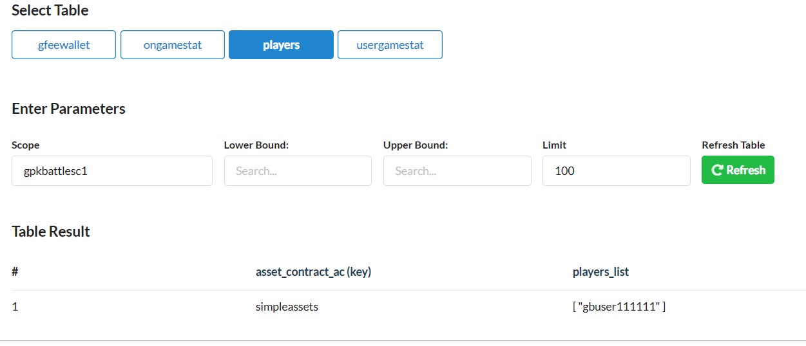

* player select cards
```console
$ cleosw push action gpkbattlesc1 sel3card '["gbuser111112", "simpleassets", "100000000007716", "100000000007695", "100000000007714"]' -p gbuser111112@active
executed transaction: 59c29973c5163ba3f6142e95c0bcdb6e9b66dd2dffc153394269091b2691b768  136 bytes  557 us
#  gpkbattlesc1 <= gpkbattlesc1::sel3card       {"player":"gbuser111112","asset_contract_ac":"simpleassets","card1_id":"100000000007716","card2_id":...
#  gpkbatescrow <= gpkbatescrow::setcstatus     {"player":"gbuser111112","card_id":"100000000007716","status":"selected"}
#  gpkbatescrow <= gpkbatescrow::setcstatus     {"player":"gbuser111112","card_id":"100000000007695","status":"selected"}
#  gpkbatescrow <= gpkbatescrow::setcstatus     {"player":"gbuser111112","card_id":"100000000007714","status":"selected"}
#  gpkbattlesc1 <= gpkbattlesc1::empifyplayer   {"asset_contract_ac":"simpleassets","player":"gbuser111112"}
warning: transaction executed locally, but may not be confirmed by the network yet         ]
```
	- view the cardwallet table & view the cards are selected
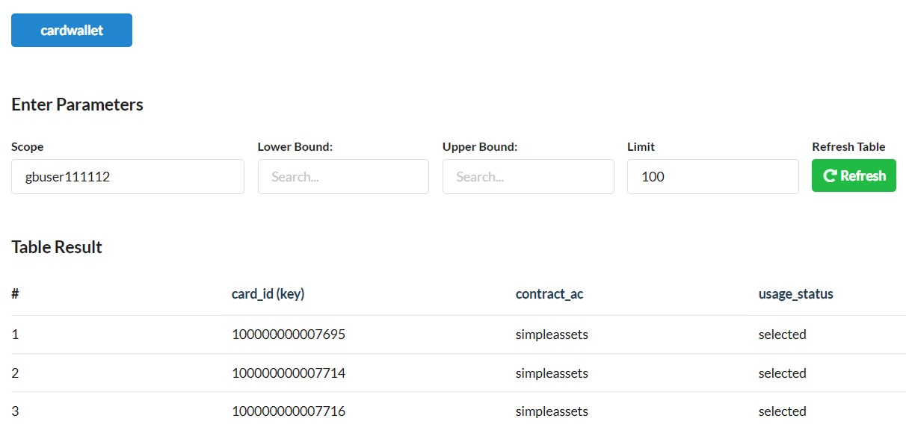
	- view the players table & confirm that the player is added for pairing
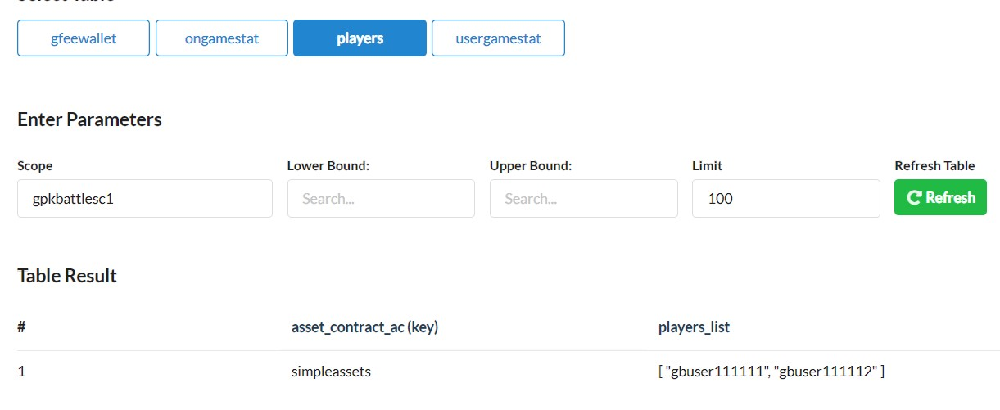

* player select cards
```console
$ cleosw push action gpkbattlesc1 sel3card '["gbuser111113", "simpleassets", "100000000007710", "100000000007721", "100000000007725"]' -p gbuser111113@active
executed transaction: e76b62439a630e219376072cadb44871afb30cb2c6762a5c19db420ebe811560  136 bytes  545 us
#  gpkbattlesc1 <= gpkbattlesc1::sel3card       {"player":"gbuser111113","asset_contract_ac":"simpleassets","card1_id":"100000000007710","card2_id":...
#  gpkbatescrow <= gpkbatescrow::setcstatus     {"player":"gbuser111113","card_id":"100000000007710","status":"selected"}
#  gpkbatescrow <= gpkbatescrow::setcstatus     {"player":"gbuser111113","card_id":"100000000007721","status":"selected"}
#  gpkbatescrow <= gpkbatescrow::setcstatus     {"player":"gbuser111113","card_id":"100000000007725","status":"selected"}
#  gpkbattlesc1 <= gpkbattlesc1::empifyplayer   {"asset_contract_ac":"simpleassets","player":"gbuser111113"}
warning: transaction executed locally, but may not be confirmed by the network yet         ]
```
	- view the cardwallet table & view the cards are selected
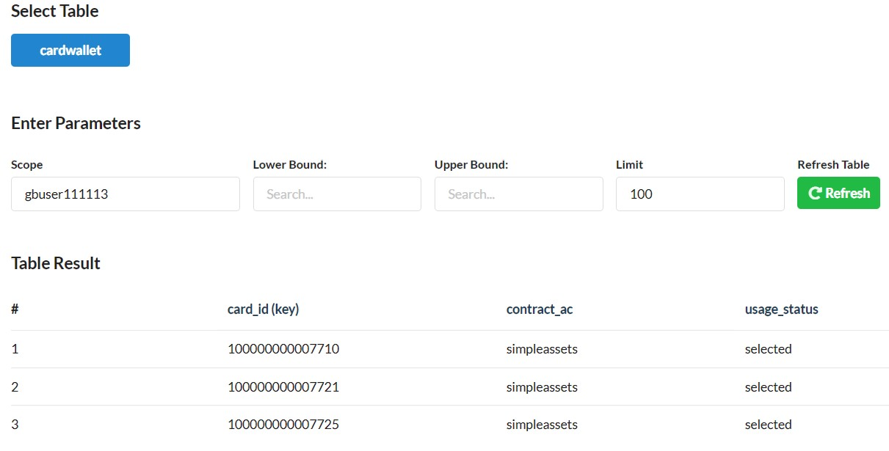
	- view the players table & confirm that the player is added for pairing
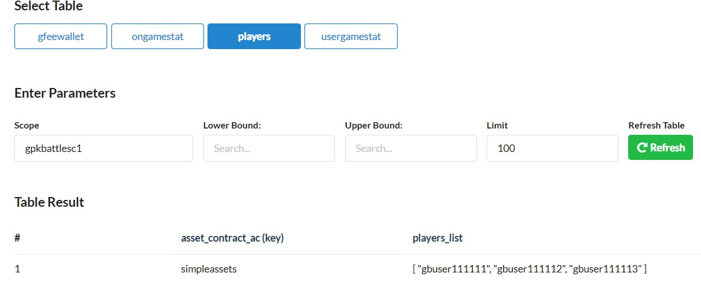

### 4. player wants to pair with another player (out of the players list)
* player `gbuser111111` pairs with another on a random basis
```console
$ cleosw push action gpkbattlesc1 pairwplayer '["gbuser111111", "simpleassets"]' -p gbuser111111@active
executed transaction: fd4ba80759a26441b07bc101200797e7b46d794a5e2de82d3cbd99b91abc3717  112 bytes  533 us
#  gpkbattlesc1 <= gpkbattlesc1::pairwplayer    {"player_1":"gbuser111111","asset_contract_ac":"simpleassets"}
#  gpkbattlesc1 <= gpkbattlesc1::sendalert      {"user":"gbuser111111","message":"You have been paired with gbuser111112 with game_id: 1000173323348...
#  gpkbattlesc1 <= gpkbattlesc1::sendalert      {"user":"gbuser111112","message":"You have been paired with gbuser111111 with game_id: 1000173323348...
#  gbuser111111 <= gpkbattlesc1::sendalert      {"user":"gbuser111111","message":"You have been paired with gbuser111112 with game_id: 1000173323348...
#  gbuser111112 <= gpkbattlesc1::sendalert      {"user":"gbuser111112","message":"You have been paired with gbuser111111 with game_id: 1000173323348...
warning: transaction executed locally, but may not be confirmed by the network yet         ]
```
	- view the players table after pairing and confirm that the 2 players are removed from the table
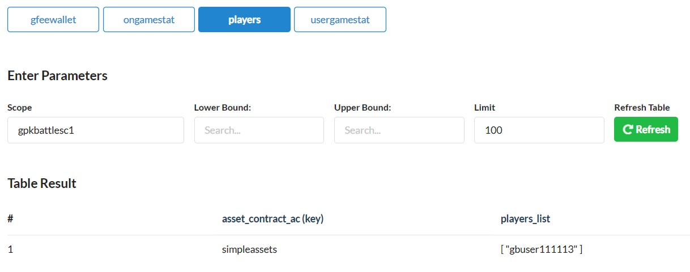
	- view the game table
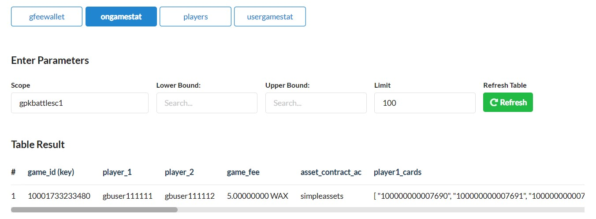

### 5. Either of the player (in the game row) wants to pair

#### player `gbuser111112` wants to play 
1. using `play` ACTION
```console
$ cleosw push action gpkbattlesc1 play '["10001733233480"]' -p gpkbattlesc1@active
executed transaction: 7fa18fede4046adf4a864cd23cd26f87ca6d90af8ec6e1ce7827906325bcfc2e  104 bytes  276 us
#  gpkbattlesc1 <= gpkbattlesc1::play           {"game_id":"10001733233480"}
#      orng.wax <= orng.wax::requestrand        {"assoc_id":"10001733233480","signing_value":"6329392500095716400","caller":"gpkbattlesc1"}
warning: transaction executed locally, but may not be confirmed by the network yet         ]
```
	- view the game table after the result is declared
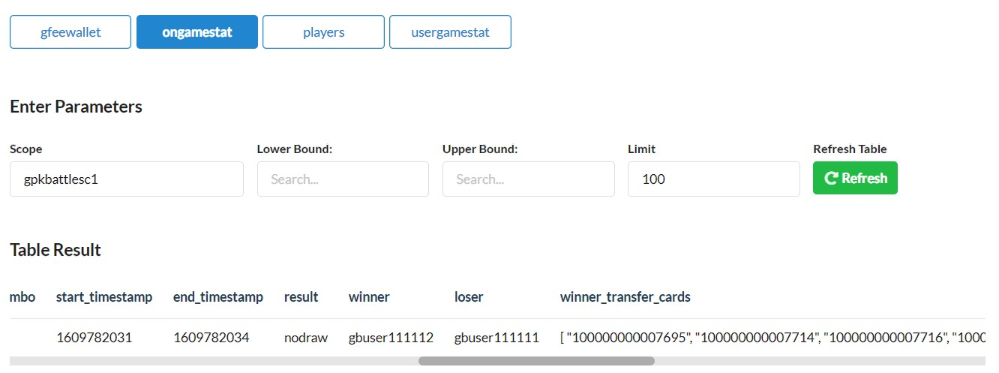
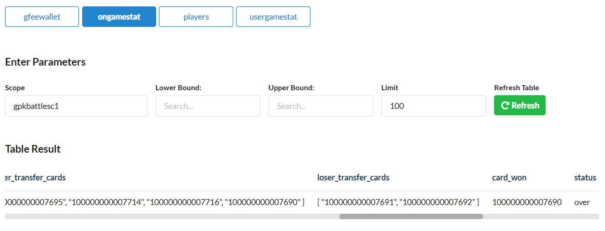
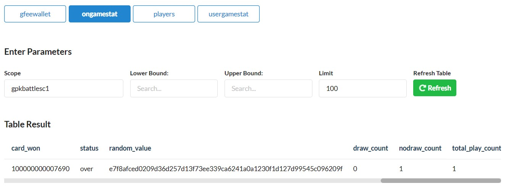

2. Now, disburse the cards, if the result is "nodraw"
```console
$ cleosw push action gpkbattlesc1 disndcards '["10001733233480"]' -p gpkbattlesc1@active
executed transaction: 15b8d0d4bef9ffd52742cd2c24dd827216a1b1ea236407830d403c2f8b738014  192 bytes  1110 us
#  gpkbattlesc1 <= gpkbattlesc1::disndcards     {"game_id":"10001733233480"}
#  gpkbatescrow <= gpkbatescrow::disburse       {"game_id":"10001733233480"}
#  gpkbattlesc1 <= gpkbattlesc1::moergameinfo   {"game_id":"10001733233480","message":"your game with id: '10001733233480' is moved to 'usergamestat...
#  simpleassets <= simpleassets::transfer       {"from":"gpkbatescrow","to":"gbuser111112","assetids":["100000000007695","100000000007714","10000000...
#  simpleassets <= simpleassets::transfer       {"from":"gpkbatescrow","to":"gbuser111111","assetids":["100000000007691","100000000007692"],"memo":"...
#  gpkbatescrow <= simpleassets::transfer       {"from":"gpkbatescrow","to":"gbuser111112","assetids":["100000000007695","100000000007714","10000000...
#  gbuser111112 <= simpleassets::transfer       {"from":"gpkbatescrow","to":"gbuser111112","assetids":["100000000007695","100000000007714","10000000...
#  gpkbatescrow <= simpleassets::transfer       {"from":"gpkbatescrow","to":"gbuser111111","assetids":["100000000007691","100000000007692"],"memo":"...
#  gbuser111111 <= simpleassets::transfer       {"from":"gpkbatescrow","to":"gbuser111111","assetids":["100000000007691","100000000007692"],"memo":"...
#  gpkbattlesc1 <= gpkbattlesc1::trincomegfee   {"player":"gbuser111111","qty":"5.00000000 WAX"}
#  gpkbattlesc1 <= gpkbattlesc1::trincomegfee   {"player":"gbuser111112","qty":"5.00000000 WAX"}
#  gpkbattlesc1 <= gpkbattlesc1::sendalert      {"user":"gbuser111111","message":"your game with id: '10001733233480' is moved to 'usergamestat' tab...
#  gpkbattlesc1 <= gpkbattlesc1::sendalert      {"user":"gbuser111112","message":"your game with id: '10001733233480' is moved to 'usergamestat' tab...
#   eosio.token <= eosio.token::transfer        {"from":"gpkbattlesc1","to":"gpkbatincome","quantity":"5.00000000 WAX","memo":"transfer game fee"}
#  gpkbattlesc1 <= eosio.token::transfer        {"from":"gpkbattlesc1","to":"gpkbatincome","quantity":"5.00000000 WAX","memo":"transfer game fee"}
#  gpkbatincome <= eosio.token::transfer        {"from":"gpkbattlesc1","to":"gpkbatincome","quantity":"5.00000000 WAX","memo":"transfer game fee"}
#   eosio.token <= eosio.token::transfer        {"from":"gpkbattlesc1","to":"gpkbatincome","quantity":"5.00000000 WAX","memo":"transfer game fee"}
#  gpkbattlesc1 <= eosio.token::transfer        {"from":"gpkbattlesc1","to":"gpkbatincome","quantity":"5.00000000 WAX","memo":"transfer game fee"}
#  gpkbatincome <= eosio.token::transfer        {"from":"gpkbattlesc1","to":"gpkbatincome","quantity":"5.00000000 WAX","memo":"transfer game fee"}
#  gbuser111111 <= gpkbattlesc1::sendalert      {"user":"gbuser111111","message":"your game with id: '10001733233480' is moved to 'usergamestat' tab...
#  gbuser111112 <= gpkbattlesc1::sendalert      {"user":"gbuser111112","message":"your game with id: '10001733233480' is moved to 'usergamestat' tab...
warning: transaction executed locally, but may not be confirmed by the network yet         ]
```
	- view the game table and find there is no row as the data has been moved to usergamestat table
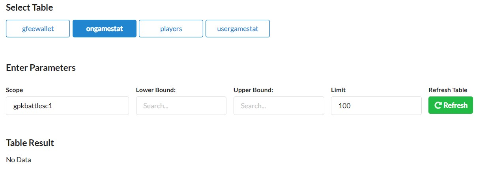
	- view the player_1 usergamestat table 
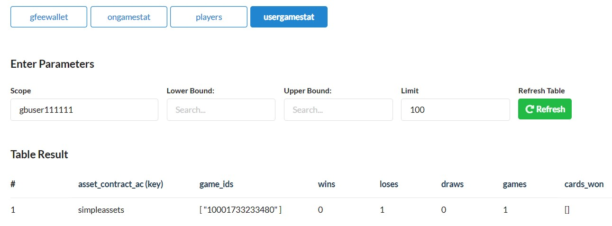
	- view the player_2 usergamestat table 
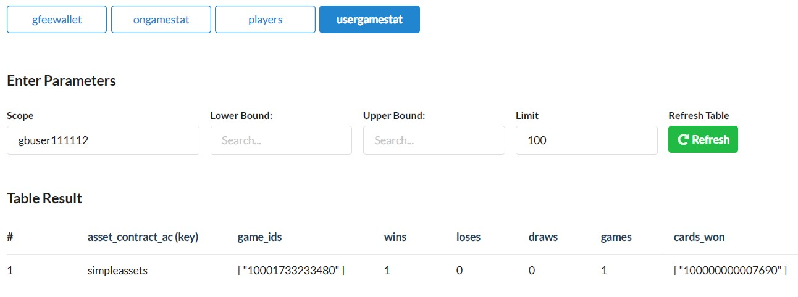
	- view the player_1 cardwallet table and ensure that there are no cards available as those have been moved from escrow to simpleassets contract
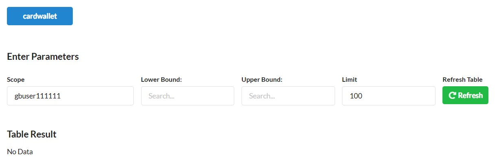
	- view the player_2 cardwallet table and ensure that there are no cards available as those have been moved from escrow to simpleassets contract
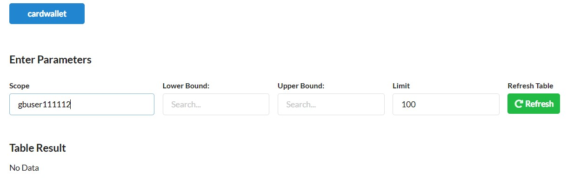
	- view the sassets game table & view that the gpkbatescrow contract is not the owner of those 6 cards played
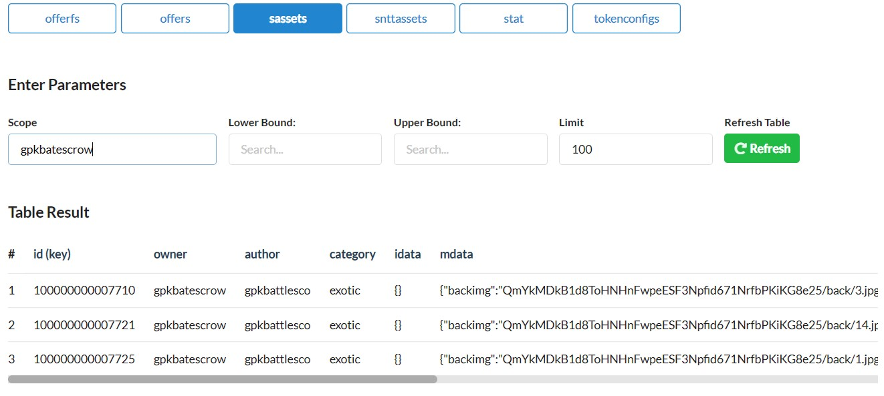
	- Also, the gamefee of each players has been transferred to `gpkbatincome` account
