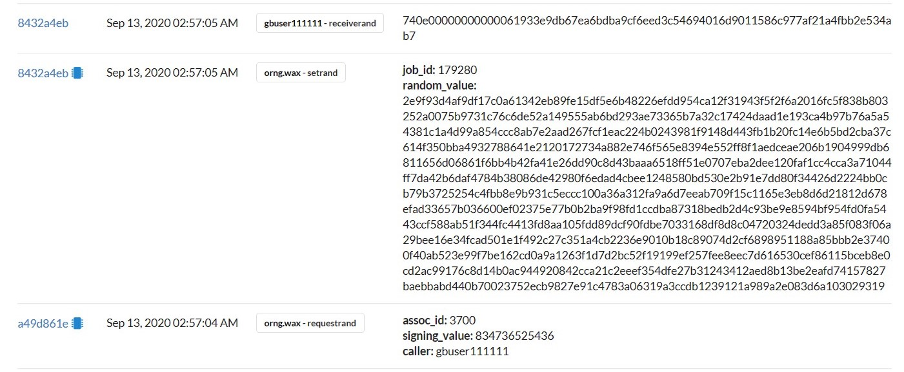
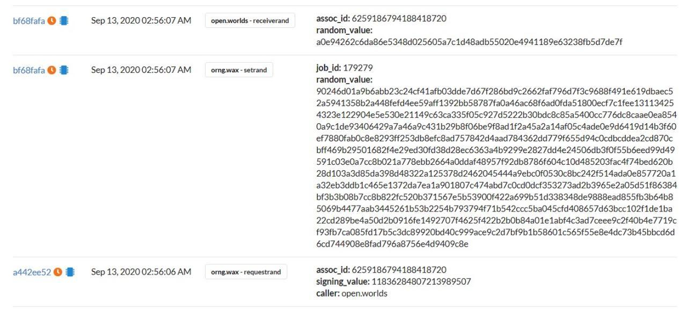

## NOTES
* Source: https://github.com/worldwide-asset-exchange/wax-orng
* Basically, you call the "requestrand" action, and then a few blocks later the oracle account calls the "receiverand" action in your contract.
* RNG is generated for a contract `open.worlds` in 3 steps:
	- `orng.wax - requestrand`
	- `orng.wax - setrand`
	- `open.worlds - receiverand`
* Both the last 2 steps generate random no.s
	- step-2: The random value in `setrand` is the full RSA signature in string form
	- step-3: random value in `receiverand` (which is the one that your account gets the callback with) is the sha256 hash of that signature
* A user `gbuser111111` generates random no. by passing a different signing_value per transaction
```console
$ cleosw push action orng.wax requestrand '["3700", "834736523243", "gbuser111111"]' -p gbuser111111@active
executed transaction: 01656e6492d7efa76a4688e426aac2a809fdcfacedab43bf1f268dc324327372  120 bytes  243 us
#      orng.wax <= orng.wax::requestrand        {"assoc_id":3700,"signing_value":"834736523243","caller":"gbuser111111"}
warning: transaction executed locally, but may not be confirmed by the network yet         ]
```
	- Here, when the action `requestrand` is executed, where `gbuser111111` consumes 376 bytes. View [here](https://wax-test.bloks.io/transaction/01656e6492d7efa76a4688e426aac2a809fdcfacedab43bf1f268dc324327372)
	- after few secs, this action - `setrand` is executed, where `gbuser111111` releases 256 bytes. View [here](https://wax-test.bloks.io/transaction/93b810514e11a97001d8565f31a54456eae44ab0d62c72969cf702e4bd5e68ec)
	- `oracle.wax` generates the random number using `orng.wax::setrand` action
	- all the `signing_value` are stored here:
```console
$ cleosw get table orng.wax orng.wax signvals.a
{
  "rows": [{
      "signing_value": 0
    },{
      "signing_value": 1
    },{
      "signing_value": 11
    },{
      "signing_value": 22
    },{
      "signing_value": 31
    },{
      "signing_value": 42
    },{
      "signing_value": 52
    },{
      "signing_value": 62
    },{
      "signing_value": 69
    },{
      "signing_value": 70
    }
  ],
  "more": true,
  "next_key": "72"
}
```

### For a User account


* Here, the rng is not generated in the last step, as this is a user account & no params supplied as per this code line. [Source](https://github.com/worldwide-asset-exchange/wax-orng/blob/develop/src/orng.cpp#L111-L115)
```cpp
...
...
action(
        {get_self(), "active"_n}, 
        job_it->caller, "receiverand"_n,
        std::tuple(job_it->assoc_id, rv_hash))
        .send();
...
...
```

### For a Contract account



## References
* [WAX Random Number Generator (WAX RNG)](https://developer.wax.io/dapps/wax-random-number-generator-wax-rng/)
* [Create a WAX RNG Smart Contract](https://developer.wax.io/dapps/create-a-wax-rng-smart-contract/)
* [WAX RNG Basics](https://developer.wax.io/dapps/wax-rng-basics/)