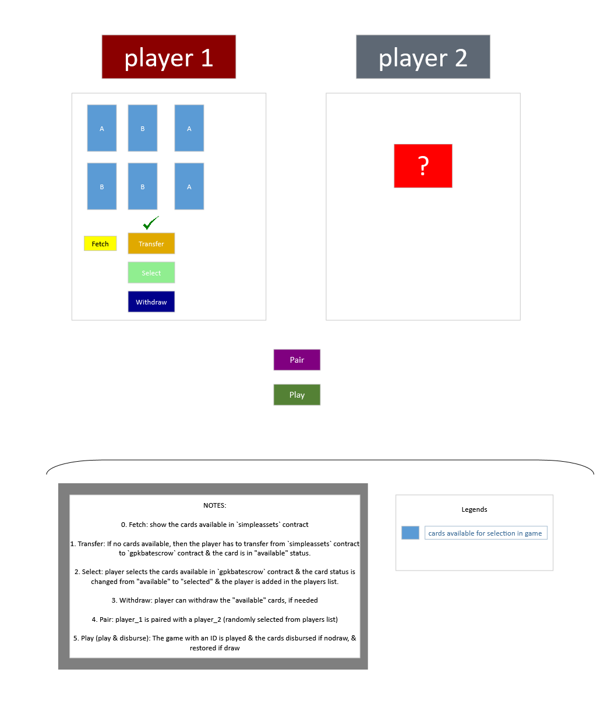
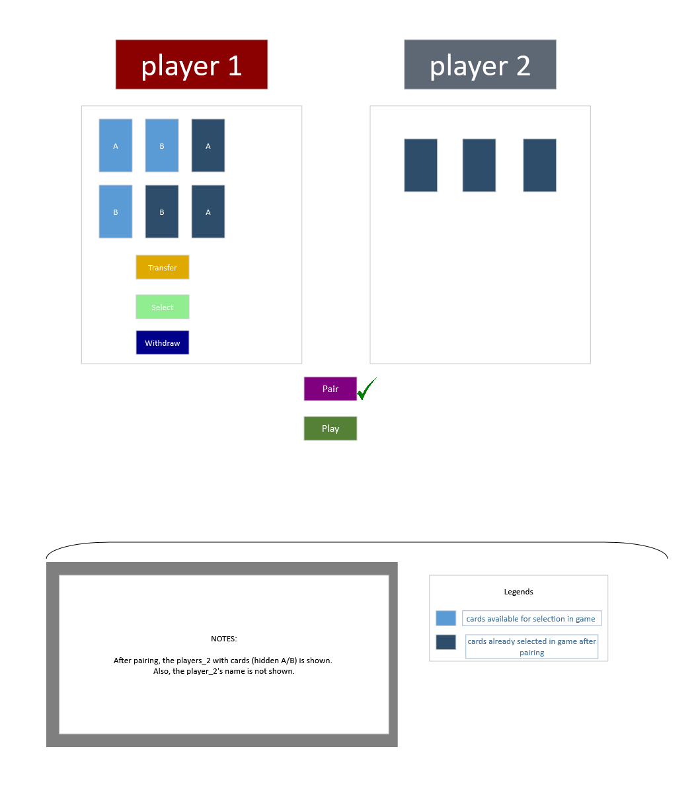
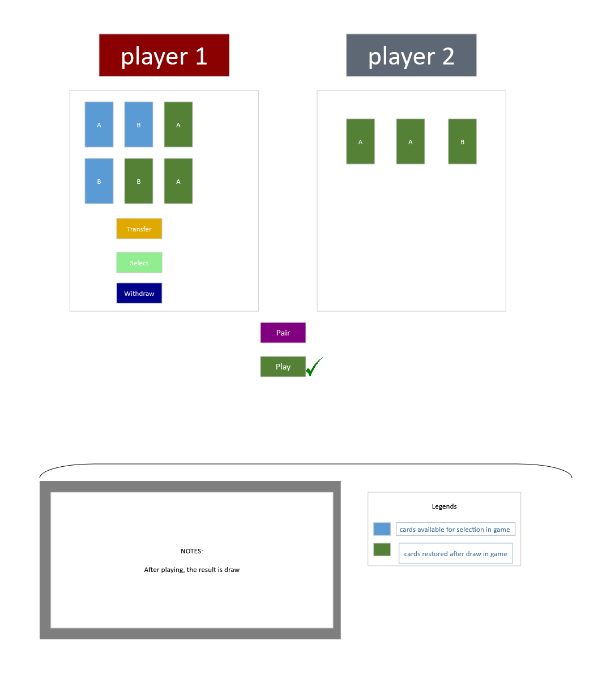
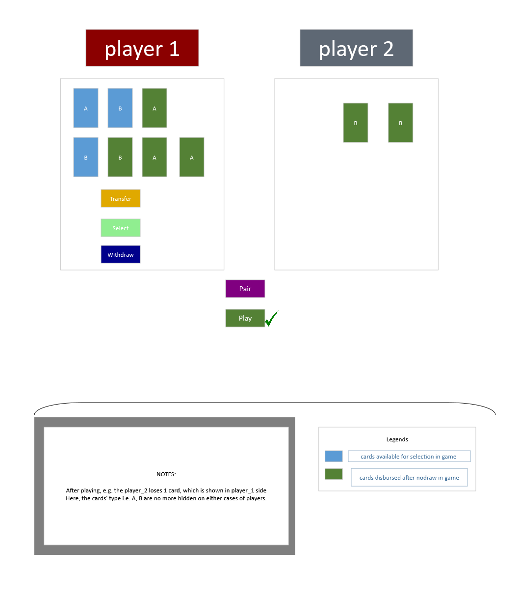

# GPK.Battles Game UI
## 0. After fetching cards from `simpleassets` contract, the cards are shown

  

## 1. After transferring all shown cards in `simpleassets` contract to `gpkbatescrow` contract
> NOTE: Here, many cards (no limit) can be transferred at once which saves CPU, NET resources & then the player can select cards subsequently.

  

## 2. After selecting cards (max. 3 of either `2a1b`/`1a2b`)

  

## 3. After pairing with a player

  

## 4. After playing
### A. Draw

  

### B. No Draw
> NOTE: Here, 2 ACTIONs are executed in sequence after 3 sec of first's success. `play` >> `disndcards`

  

